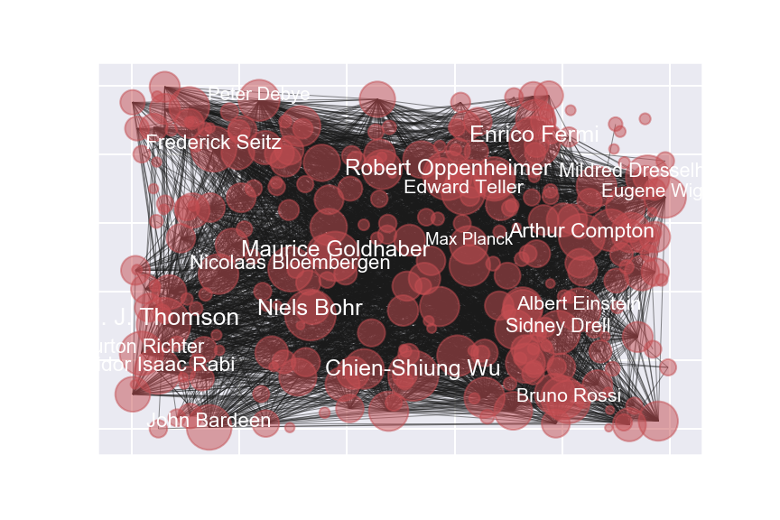

# Physicist-net
<p align="center">
  
</p>

## Description

Every wonder who was the most well-connected Physicist? I use a naive approach to answer this question. Wikipedia has a list of [physicsts](https://en.wikipedia.org/wiki/List_of_physicists). I scrape the Wikipedia page of each Physicist on this list and construct a graph object in the following way:

Each node respresents a Physicist.
For every wikipedia page, I count the number of unique Physicists and add an edge between every pair present.
If an edge already exists, I increment the weight by 1.

The graph above is aa snapshot of the resulting graph.

## Prerequire package

```bash
pip install BeautifulSoup
```

## Usage

Follow along the jupyter notebook wiki-network.ipynb

## Contributing
Pull requests are welcome. For major changes, please open an issue first to discuss what you would like to change.

Please make sure to update tests as appropriate.

## Further work

I love learning and one approach to exploring a new field is to learn about the ideas of the most influential thinkers in the area. How does one come up with such a ranking? This project is one solution. You can imagine applying this to many different fields!

